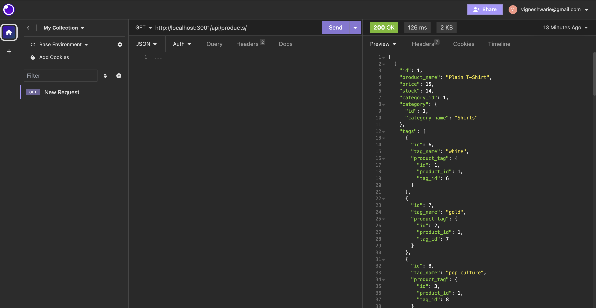
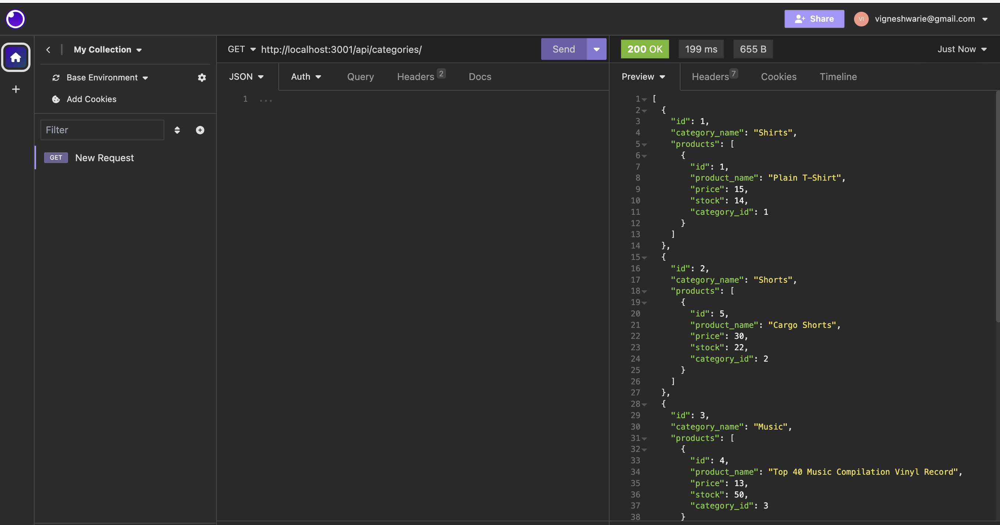
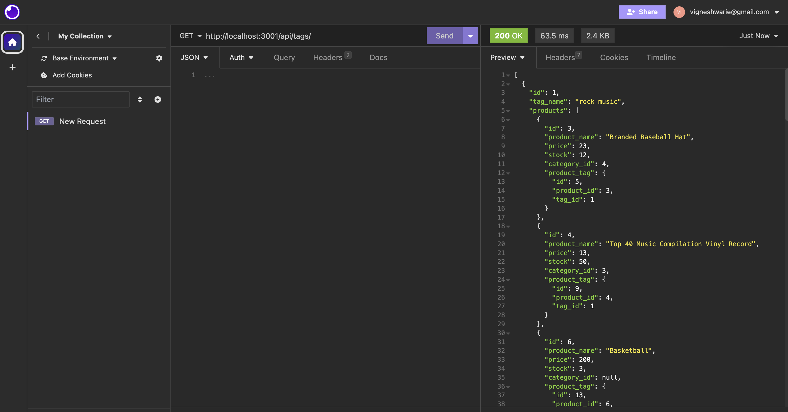
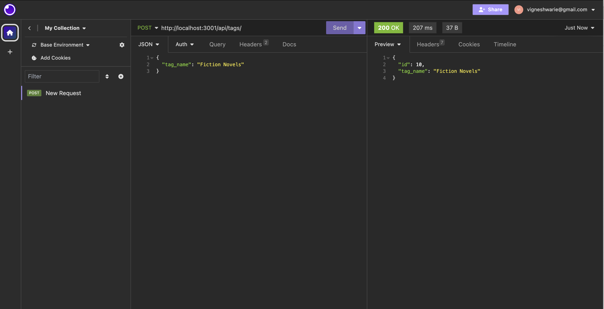
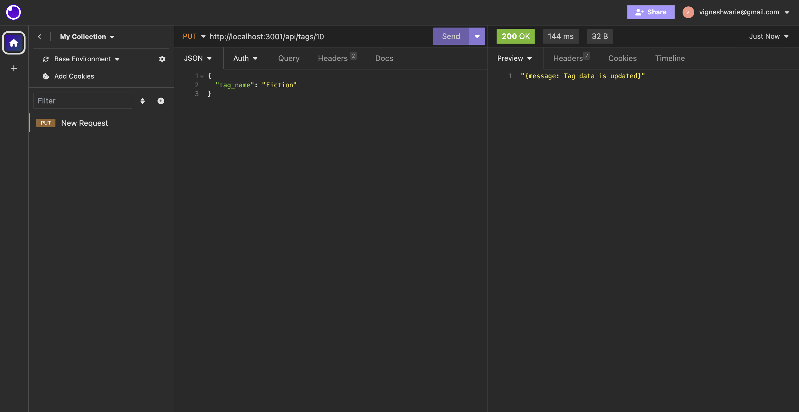
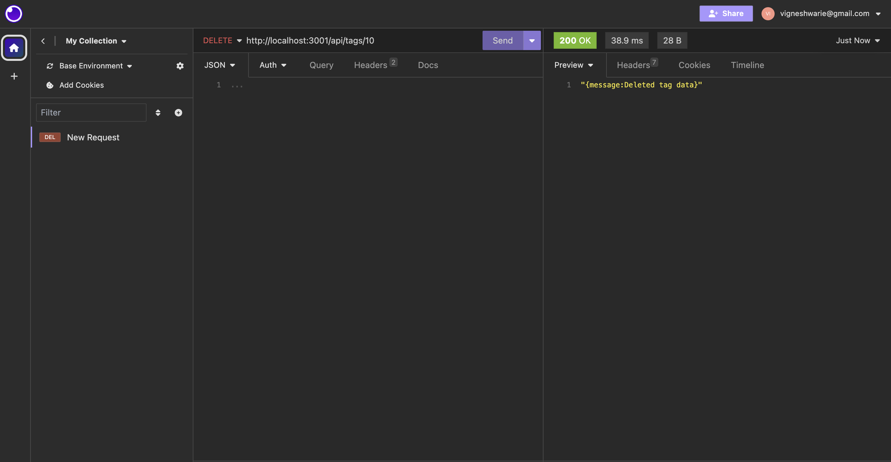

# vGadgetGallery

## Description

vGadgetGallery is a simple server-side back-end application to manage e-commerce websites. This application handles all the user requests as API requests, and the API lifecycle can be tested on API platforms like Insomnia or Postman. The application was developed using server-side technologies like Node.js and Express.js and used the Sequelize package to interact with the MySQL database. The application also uses the dotenv package to store and protect environment-related sensitive information.

## Installation

To run or execute the application, one must have node installed in the system and other supporting packages like express.js

Follow the guidelines in the given link to install Node.js: https://nodejs.org/en/learn/getting-started/how-to-install-nodejs, 

Follow the guidelines in the given link to install express.js: https://expressjs.com/en/starter/installing.html 

Follow the guideline in the given link to install Sequelize package : https://www.npmjs.com/package/sequelize

All the above packages are included in the package.json file, which will be installed once we have the node installed. If the node is installed, use the npm i command in the application root directory to install other packages.

## Usage

The application source code can be accessed using the given link https://github.com/Vigneshwarie/vGadgetGallery

One can download the code from the above link. To use this application, one must install all node.js, MySQL and other necessary packages as mentioned above in the installation section. Then, navigate to the db folder and execute the schema. Create an .env file and include the connection variables like MySQL user, password, and database name. To feed the seeds sample data into the database, use the commnd below.

application-folder> npm run seed

On successful installation and execution, use the following command to start the application. 

application-folder> node server

Navigate to Insomnia and test the APIs for all API requests and responses.

Products can be tested using the URL, http://localhost:3001/api/products/

Categories can be tested using the URL, http://localhost:3001/api/categories/

Tags can be tested using the URL, http://localhost:3001/api/tags/

The application supports functionality like GET, POST, PUT, and DELETE requests.

## Walkthrough Video

## Credits

Below documentation on will help to formulate user requests

https://sequelize.org/docs/v7/querying/select-in-depth/

https://sequelize.org/docs/v6/core-concepts/assocs/

## License

Please refer to the LICENSE in the repo.
